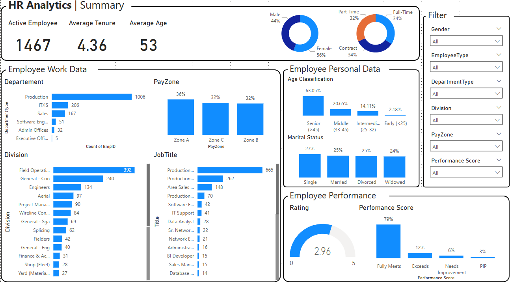
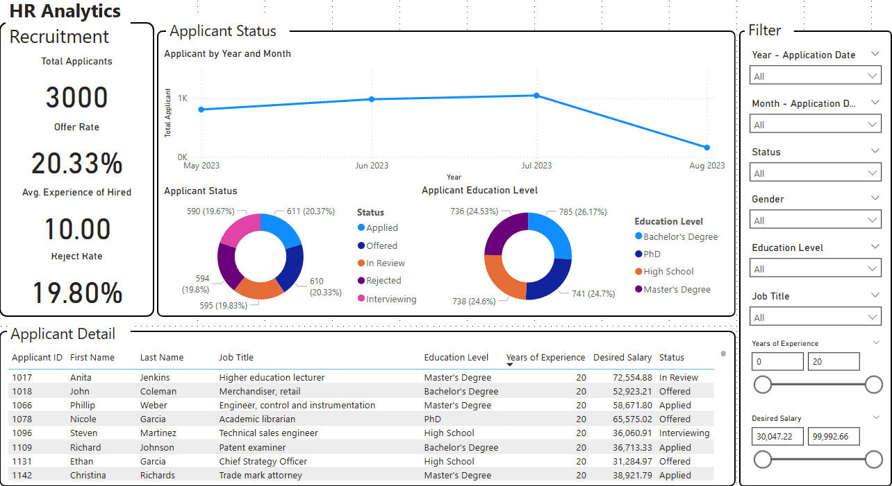
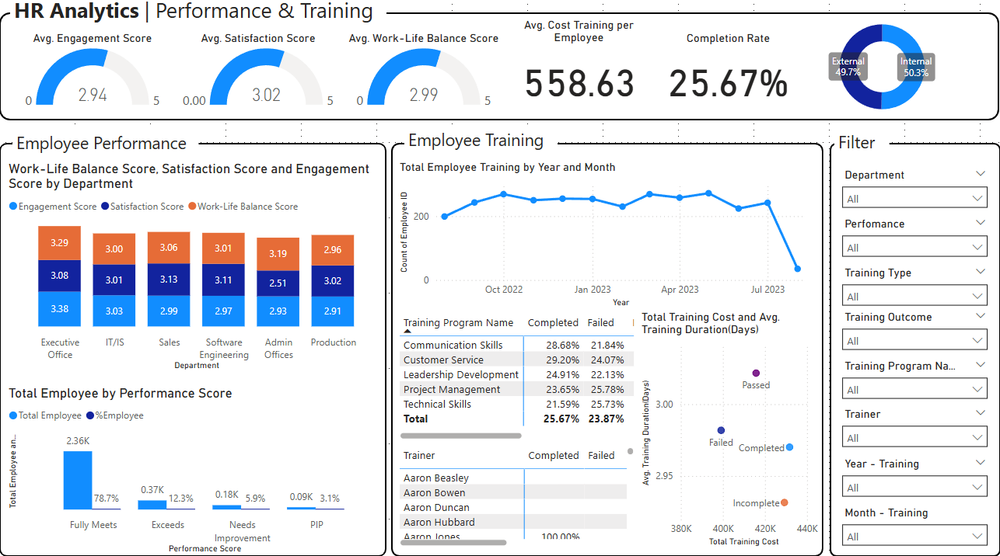
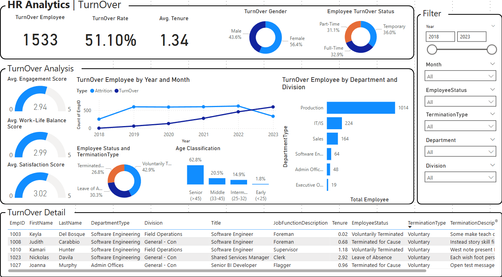

# HR Analytics Dashboard using Power BI

A business intelligence project designed to visualize and analyze HR metrics for better data-driven decisions across recruitment, performance management, training effectiveness, and employee turnover.

---

## Project Description

This HR Analytics project leverages four structured datasets to build an interactive Power BI dashboard that provides a holistic view of the organization's human resources data. The dashboard enables HR teams and decision-makers to monitor key employee metrics, identify areas of improvement, and improve strategic planning through real-time insights.

---

## Data Source

All datasets used in this project are anonymized and synthetically generated for educational and demonstration purposes.

> **Source**: Public sample dataset hosted on GitHub  
> [View Dataset on GitHub](https://github.com/denindrap23/Power-BI/blob/main/HR-Analytics/dataset)

---

## Dataset Overview

| Dataset | Description |
|--------|-------------|
| `employee_data` | Core employee information including job title, department, pay zone, gender, status, and performance. |
| `employee_engagement_survey_data` | Annual engagement survey data with scores for satisfaction, engagement, and work-life balance. |
| `recruitment_data` | Applicant details including demographics, education level, experience, desired salary, and application status. |
| `training_and_development_data` | Training records including training program name, type, outcome, cost, duration, and trainer info. |

---

## Objective

The primary objectives of this project are to:

- Provide a centralized view of HR performance indicators.
- Improve decision-making by visualizing workforce and recruitment trends.
- Identify engagement, satisfaction, and training efficiency across departments.
- Track employee turnover patterns and potential risk areas.
- Enhance overall employee experience through actionable insights.

---

## Key Features

- Interactive filters for deep drill-down and dynamic analysis.
- KPI cards and trend charts to track real-time workforce health.
- Visual breakdown of employee and applicant demographics.
- Training program success analysis with outcome and cost comparison.
- Turnover heatmap and timeline for strategic attrition insights.

---

## Tools Used

- **Power BI Desktop** – Data modeling and visualization
- **Power Query** – Data cleaning and transformation
- **DAX** – Measures and calculated columns

---

## Dashboard Overview

This project consists of **four interactive dashboard pages** developed in Power BI:

### 1. Summary Dashboard
Provides an overview of employee demographics, department structure, and performance distribution.

**Key Visuals:**
- Active Employee Count, Average Tenure, and Average Age
- Gender & Employee Type Distribution
- Department, Division, Job Title, and PayZone Breakdown
- Performance Score Overview

---

### 2. Recruitment Dashboard
Visualizes the recruitment funnel and candidate demographics.

**Key Visuals:**
- Total Applicants, Offer Rate, Rejection Rate
- Applicant Status Trend Over Time
- Education Level Distribution
- Applicant Detail Table (with filters for salary, experience, etc.)

---

### 3. Performance & Training Dashboard
Analyzes employee engagement, satisfaction, and training success metrics.

**Key Visuals:**
- Average Engagement, Satisfaction, Work-Life Balance Scores
- Score Breakdown by Department
- Training Completion Rate and Program Distribution
- Training Cost vs Duration Scatter Plot

---

### 4. Turnover Dashboard
Tracks turnover trends and identifies high-risk segments within the workforce.

**Key Visuals:**
- Turnover Rate, Total Turnover, Average Tenure at Exit
- Gender, Employee Type, and Termination Reason Breakdown
- Turnover by Department and Year
- Exit Detail Table

---

