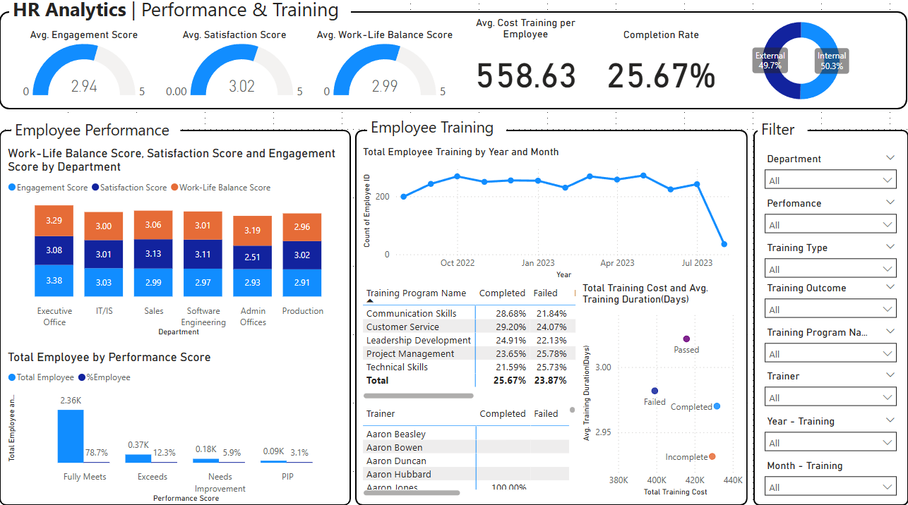
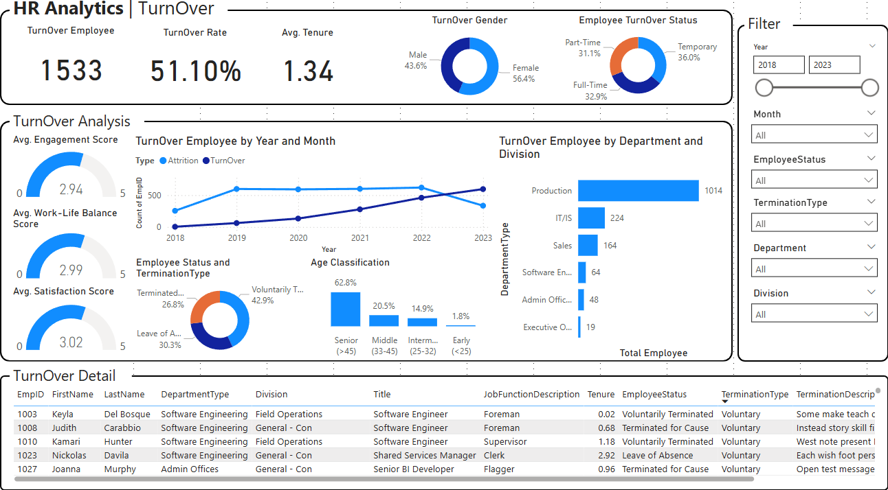

# Power BI Portfolio Projects

Welcome to my personal Power BI portfolio repository! Here you will find a collection of Power BI projects and dashboards that demonstrate my skills and expertise in data visualization, business intelligence, and analytics using Power BI.

## About Me

I am a passionate data enthusiast with a strong background in Power BI. I have extensive experience in transforming raw data into meaningful insights, creating interactive dashboards, and helping businesses make data-driven decisions. This portfolio showcases my proficiency in Power BI and highlights my ability to effectively communicate complex data visually. 

---

## [1. Project HR Analytics](https://github.com/denindrap23/Power-BI/blob/main/HR-Analytics/dataset)

A business intelligence project designed to visualize and analyze HR metrics for better data-driven decisions across recruitment, performance management, training effectiveness, and employee turnover. This HR Analytics project leverages four structured datasets to build an interactive Power BI dashboard that provides a holistic view of the organization's human resources data. The dashboard enables HR teams and decision-makers to monitor key employee metrics, identify areas of improvement, and improve strategic planning through real-time insights.

### Dashboard Previews

| Summary | Recruitment | Perfomance & Training | Turnover |
|---------------|---------------|---------------|---------------|
|  |  |  |  |

---
